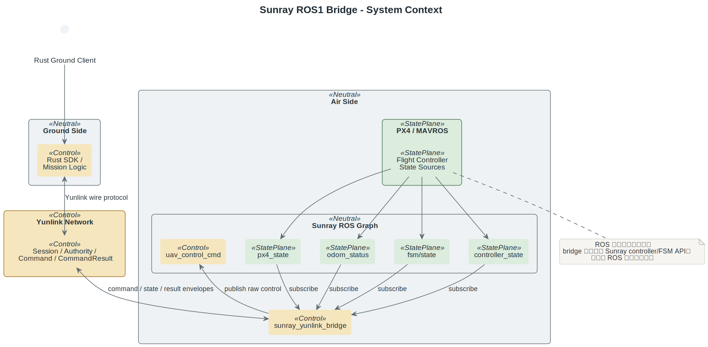
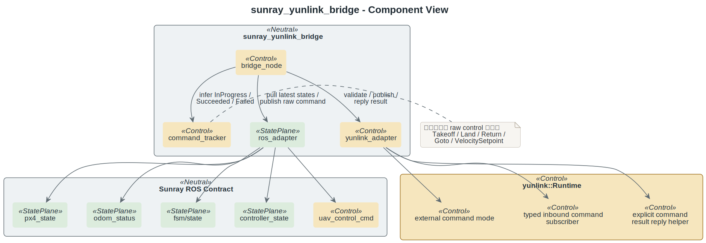
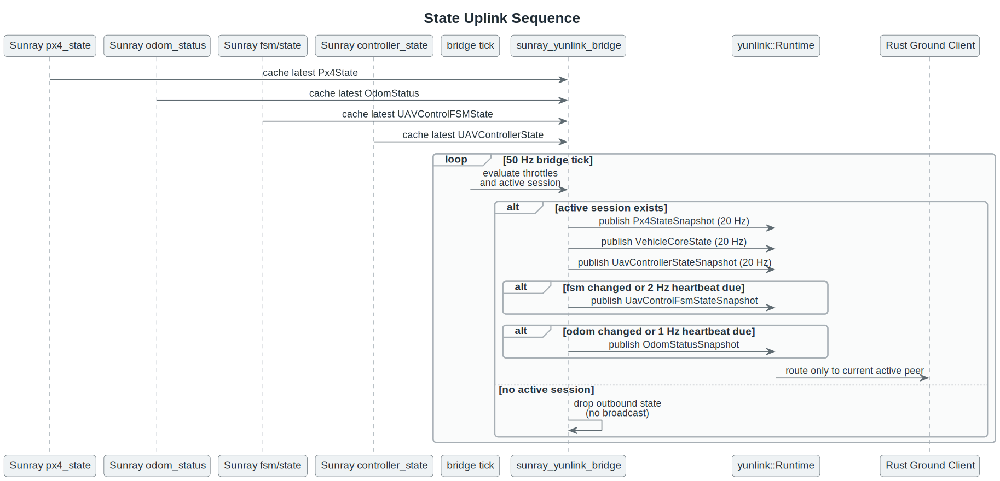
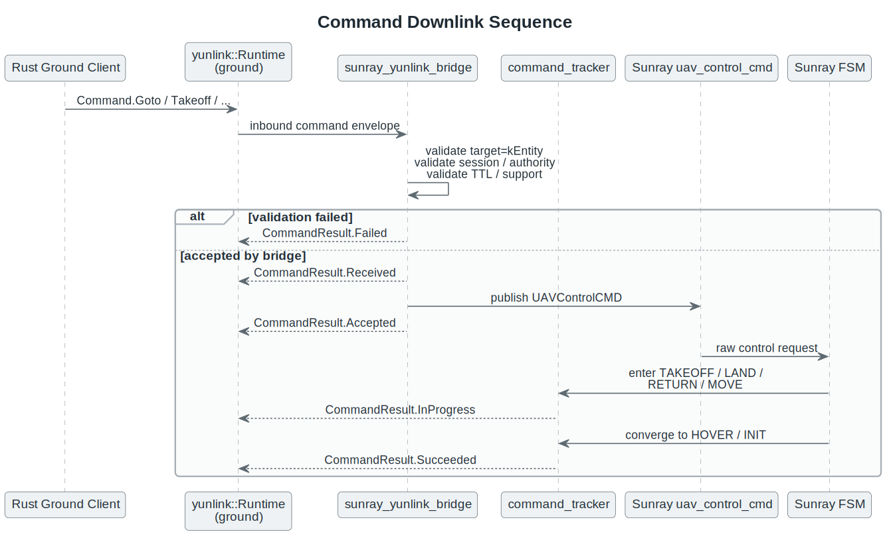
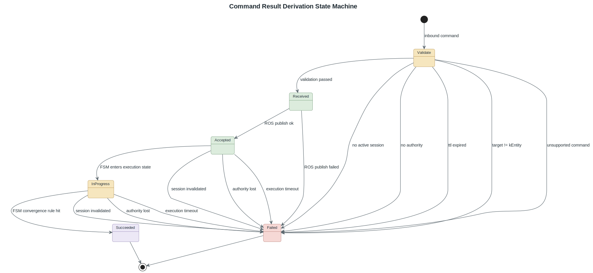
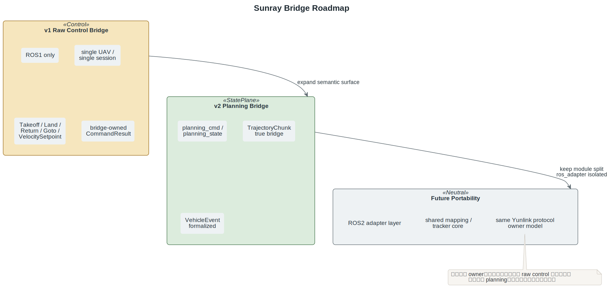

# Sunray ROS1 机载 Yunlink Bridge 总体方案

## 背景与目标

`sunray_v2` 目前在机载端已经形成了一套稳定的 ROS1 topic contract，而 `yunlink` 的长期目标是成为统一的空地协议与运行时。当前最稳妥的一期落地方式，不是把 Yunlink 直接侵入 Sunray controller/FSM 内核，而是新增一个独立 ROS1 bridge 进程，专门负责：

- 把 Yunlink 下行命令翻译成 Sunray 现有 `uav_control_cmd`。
- 把 Sunray 现有状态 topic 组织成 Yunlink 上行快照。
- 让 `Session / Authority / CommandResult` 的 owner 明确停留在 `Yunlink + bridge`，而不是扩散进 Sunray core。

一期边界固定如下：

- 只做 ROS1。
- 只做机载端。
- 只做单 UAV、单 active session、一对一链路。
- `TargetScope` 只接受 `kEntity`。
- 状态上行优先，同时把远程控制闭环路径设计完整。
- `planning_cmd / planning_state` 只预留文档扩展位，不进入一期实现与验收。

## 为什么是 Bridge

bridge 方案的核心价值，不是“少写代码”，而是把系统边界锁死：

- Sunray 继续只暴露 ROS contract，不被 Yunlink 绑死到内部类、FSM API、controller 实现细节。
- Yunlink runtime 继续负责网络边界、session、authority 和回包路径，不让 Sunray 理解这些协议概念。
- bridge 成为唯一的协议适配层，后续无论是补 planning bridge，还是迁 ROS2，都有明确改动面。

这也是为什么一期 bridge 包仍位于外部 Sunray ROS 工作区里的独立 catkin package，而官方 overview 放在 `yunlink/docs/bindings/ros-sunray-bridge-overview.md`：实现归 Sunray 工作区，协议主导权与官方集成说明归 Yunlink。

## 系统边界

- `yunlink` 仓库新增 runtime 外部命令处理模式。
  bridge 使用 `CommandHandlingMode::kExternalHandler`，关闭默认 `runtime-auto-result`。
- 外部 Sunray 工作区中的 Yunlink bridge 是独立 catkin 包、独立进程。
- bridge 只订阅和发布 Sunray 既有 topic。
  不调用 Sunray controller/FSM 内部 C++ 接口。
- 地面端不运行 ROS。
  Rust ground client 直接接 Yunlink，机载 bridge 才是 ROS 适配面。

## Owner Matrix

| 关注点 | Owner | 备注 |
| --- | --- | --- |
| 控制意图 | Rust ground client | 负责发起命令、消费状态与结果 |
| Session / Authority / 网络边界 | Yunlink + bridge | Sunray 不感知 ownership 模型 |
| 正式 `CommandResult` | bridge | 一期唯一正式 owner |
| 飞行执行 | Sunray FSM / Controller | 只吃 ROS `uav_control_cmd` |
| 飞控与底层状态 | PX4 / MAVROS / Sunray topics | bridge 只做转译与裁剪 |

## ROS/Yunlink 接口映射

bridge 的 ROS topic 面固定为：

- 订阅 `${uav_ns}/sunray/px4_state`
- 订阅 `${uav_ns}/sunray/localization/odom_status`
- 订阅 `${uav_ns}/sunray/fsm/state`
- 订阅 `${uav_ns}/sunray/controller_state`
- 发布 `${uav_ns}/sunray/uav_control_cmd`

bridge 的 Yunlink 上行语义固定为：

- `VehicleCoreState`
- `Px4StateSnapshot`
- `OdomStatusSnapshot`
- `UavControlFsmStateSnapshot`
- `UavControllerStateSnapshot`

一期不对外正式发布 `VehicleEvent`，也不接 `planning_cmd / planning_state`。

### Ownership/Component View

### 命令映射表

| Yunlink command | Sunray ROS command | V1 status | 说明 |
| --- | --- | --- | --- |
| `TakeoffCommand` | `UAVControlCMD::TAKEOFF` | `supported` | 起飞动作支持；`relative_height_m / max_velocity_mps` 由 Sunray 本地配置决定，属于 `deferred` |
| `LandCommand` | `UAVControlCMD::LAND` | `supported` | 降落动作支持；`max_velocity_mps` 在 raw control v1 中 `deferred` |
| `ReturnCommand` | `UAVControlCMD::RETURN` | `supported` | 返航动作支持；`loiter_before_return_s` 在 raw control v1 中 `deferred` |
| `GotoCommand` | `UAVControlCMD::MOVE_POINT` | `supported` | 位置点与 yaw 直接映射 |
| `VelocitySetpointCommand(body_frame=false)` | `UAVControlCMD::MOVE_VELOCITY` | `supported` | `vx/vy/vz` 直接映射；`yaw_rate` 被 `synthesized` 为 `SET_YAWRATE` |
| `VelocitySetpointCommand(body_frame=true)` | `UAVControlCMD::MOVE_VELOCITY_BODY` | `synthesized` | `vx/vy` 直接映射；`fixed_height` 由最新 `Px4State` 当前高度 `synthesized`；`vz` 在 raw body velocity v1 中不可表达 |
| `TrajectoryChunkCommand` | 无 | `unsupported` | 直接回 `CommandResult.Failed(detail=unsupported-by-sunray-raw-control-v1)` |
| `FormationTaskCommand` | 无 | `unsupported` | 一期不进入 Sunray raw control |

### 状态映射表

| Sunray ROS source | Yunlink uplink | V1 status | 说明 |
| --- | --- | --- | --- |
| `Px4State` | `VehicleCoreState` | `synthesized` | 从 `Px4State` 裁剪出统一核心飞行态 |
| `Px4State` | `Px4StateSnapshot` | `supported` | 基本是一一映射 |
| `OdomStatus` | `OdomStatusSnapshot` | `supported` | `last_odometry_age_ms` 由 bridge 运行时 `synthesized` |
| `UAVControlFSMState` | `UavControlFsmStateSnapshot` | `supported` | 直接承接 Sunray FSM 公开态 |
| `UAVControllerState` | `UavControllerStateSnapshot` | `supported` | 控制器期望态、误差与推力裁剪后上行 |
| `planning/UAVPlanningState` | 无 | `deferred` | 只进入二期 planning bridge |
| `VehicleEvent` 对外面 | 无 | `deferred` | 一期不作为正式协议面 |

## 命令与状态流

### 状态上行

- `Px4StateSnapshot`：20 Hz
- `VehicleCoreState`：跟随 `Px4StateSnapshot` 同节流
- `UavControllerStateSnapshot`：20 Hz
- `UavControlFsmStateSnapshot`：变更即发，外加 2 Hz heartbeat
- `OdomStatusSnapshot`：变更即发，外加 1 Hz heartbeat

没有 active session 时，bridge 不向外发状态。存在 authority holder 时，优先只发给 authority 对端；否则只发给唯一 active session。

### 命令下行

bridge 在收到 Yunlink 入站命令后，按下面顺序处理：

1. 校验 `TargetScope::kEntity`
2. 校验 session 仍然 active
3. 校验 TTL freshness
4. 校验当前 authority 持有者就是该 `peer + session`
5. 校验命令类型是否属于 v1 覆盖面
6. 发送 `CommandResult.Received`
7. 发布 ROS `uav_control_cmd`
8. 发送 `CommandResult.Accepted`
9. 等待 Sunray FSM 推导 `InProgress / Succeeded / Failed`

### 结果状态机

bridge 是一期唯一正式 `CommandResult` owner，结果规则固定为：

- `Received`
  session / authority / target / TTL / 命令支持度都通过后发送
- `Accepted`
  成功发布 ROS `uav_control_cmd` 后发送
- `InProgress`
  Sunray FSM 进入对应执行态时发送
- `Succeeded`
  由 FSM 收敛模式推导
- `Failed`
  用于 TTL 过期、无 authority、无 active session、不支持命令、ROS publish 失败、执行超时、执行中 session 失效

成功判定固定为：

- `Takeoff`: `TAKEOFF -> HOVER`
- `Land`: `LAND -> INIT`
- `Return`: `RETURN -> HOVER`，或 `RETURN -> LAND -> INIT`
- `Goto`: `MOVE -> HOVER`
- `VelocitySetpoint`: 命令流停止后由 Sunray 自身 `MOVE -> HOVER` 收敛

## 失败与恢复模型

| 场景 | bridge 行为 | Sunray 是否感知 |
| --- | --- | --- |
| 无 active session | 在 bridge 看到命令前就由 runtime 返回 `Failed(no-active-session)` | 否 |
| 无 authority | 在 bridge 看到命令前就由 runtime 返回 `Failed(no-authority)` | 否 |
| TTL 过期 | 在 bridge 看到命令前就由 runtime 返回 `Expired(runtime-ttl-expired)` | 否 |
| `TrajectoryChunk / FormationTask` | 直接 `Failed(unsupported-by-sunray-raw-control-v1)` | 否 |
| ROS publisher 未就绪 | `Failed(ros-publish-failed)` | 否 |
| 执行超时 | `Failed(execution-timeout)` | Sunray 仍可能继续局部执行，但协议面结束 |
| 执行中 session 失效 | `Failed(session-invalidated-during-execution)` | 否 |

恢复策略同样保持简单：

- 地面端先恢复 Yunlink session，再重新 claim authority。
- bridge 不替 Sunray 做 ownership 恢复。
- Sunray 只响应新的 ROS 控制消息，不理解协议级重试。

## 一期 / 二期路线

一期交付物锁定为：

- `yunlink` runtime 外部命令处理模式
- typed inbound command subscribe
- explicit `reply_command_result(...)`
- `sunray_yunlink_bridge` ROS1 包
- raw control v1 映射、状态上行与结果推导

二期再进入：

- `planning_cmd / planning_state`
- `TrajectoryChunkCommand` 真正桥接
- `VehicleEvent` 正式对外
- ROS2 portability

