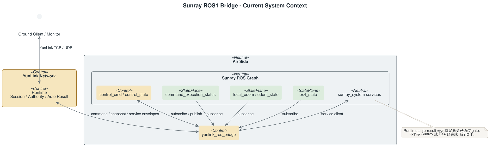
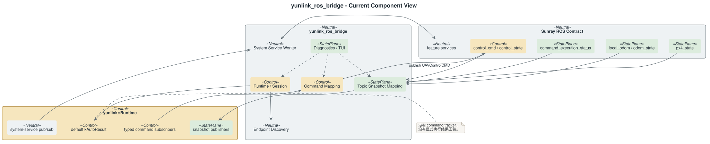
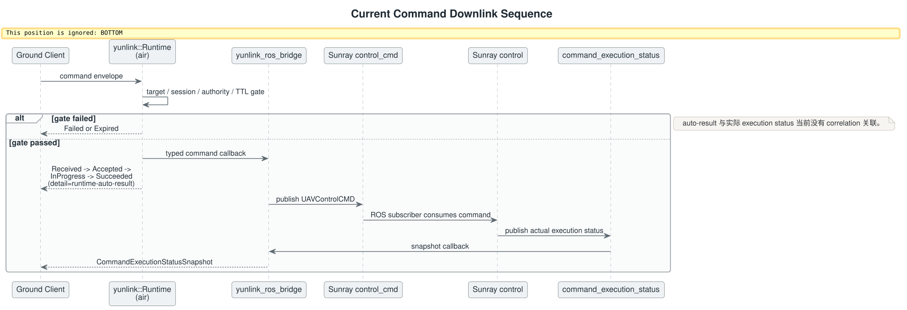
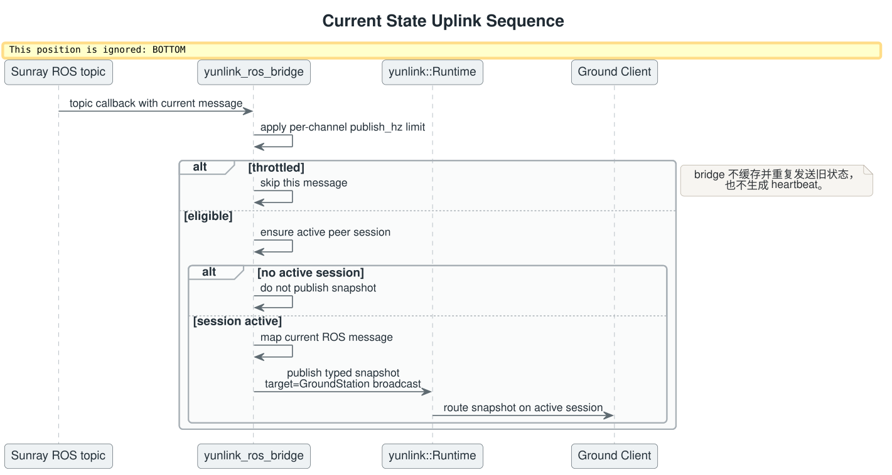

# Sunray ROS1 YunLink Bridge

本文档描述 `sunray_v2/communication/yunlink_ros_bridge` 的当前实现。它是独立 ROS1 catkin 包，负责 YunLink 与 Sunray ROS topic/service 之间的转换，不调用 Sunray controller 或定位模块的内部 C++ API。

## 当前边界

bridge 当前负责：

- 接收五类 YunLink 控制命令并发布 `sunray_msgs/UAVControlCMD`。
- 订阅六类 Sunray ROS 状态并发布对应 YunLink snapshot。
- 转发 feature list/get/start/stop 系统服务。
- 维护 YunLink TCP session、UDP 端点发现、QoS 节流和 ROS diagnostics。

bridge 当前不负责：

- 不修改或扩展 Sunray ROS 消息定义。
- 不推导飞行任务是否成功，也不实现 command tracker。
- 不把 `UAVCommandExecutionStatus` 自动关联到某条 YunLink command 的 `correlation_id`。
- 不转发 `TrajectoryChunkCommand`、`FormationTaskCommand` 或 Sunray planning topic。
- 不发布 `VehicleEvent`。

## 连接与发现

默认配置位于 `communication/yunlink_ros_bridge/config/yunlink_ros_bridge_base.yaml`：

- TCP 监听端口：`9696`
- UDP bind/target 端口：`9696` / `9898`
- UDP 发现广播端口：`9966`
- 发现周期：`1000 ms`

`remote_ip` 为空或 `remote_tcp_port` 为 `0` 时，bridge 被动等待地面端连接，并周期发布发现广播。配置远端地址后，bridge 也可以主动拨号。运行时优先复用已有 active session；session 失效后，1 秒重连定时器会清理缓存并重新等待或拨号。

状态 snapshot 发送前必须存在 active peer session。目标选择器当前固定为 Ground Station broadcast；这表示 snapshot 面向已建立会话的地面站类型目标，不表示 bridge 在无 session 时向网络裸广播业务状态。

## ROS 接口

默认 topic 如下，均可通过 YAML/launch 覆盖：

| Direction | ROS topic | ROS type |
| --- | --- | --- |
| Subscribe | `/uav1/sunray/localization/local_odom` | `nav_msgs/Odometry` |
| Subscribe | `/uav1/sunray/localization/odom_state` | `sunray_msgs/OdomState` |
| Subscribe + Publish | `/uav1/sunray/uav_control/control_cmd` | `sunray_msgs/UAVControlCMD` |
| Subscribe | `/uav1/sunray/uav_control/control_state` | `sunray_msgs/UAVControlState` |
| Subscribe | `/uav1/sunray/uav_control/command_execution_status` | `sunray_msgs/UAVCommandExecutionStatus` |
| Subscribe | `/uav1/sunray/px4_state` | `sunray_msgs/Px4State` |
| Publish | `/yunlink_ros_bridge/monitor_diagnostics` | `diagnostic_msgs/DiagnosticArray` |

## 命令下行

| YunLink command | Sunray `control_cmd` | 当前映射 |
| --- | --- | --- |
| `TakeoffCommand` | `TAKEOFF` | action-only；不携带高度或速度 |
| `LandCommand` | `LAND` | action-only；不携带降落速度 |
| `ReturnCommand` | `RETURN` | action-only；不携带盘旋时间 |
| `GotoCommand` | `MOVE_POINT` | 映射 XYZ 与 yaw，yaw mode 固定为 `SET_YAW` |
| `VelocitySetpointCommand(body_frame=false)` | `MOVE_VELOCITY` | 映射 XYZ 速度与 yaw rate |
| `VelocitySetpointCommand(body_frame=true)` | `MOVE_VELOCITY_BODY` | 映射 XY 速度；`fixed_height` 使用最近一次 PX4 local odometry 高度；非零 Z 速度被忽略并记录警告 |

`TakeoffCommand`、`LandCommand`、`ReturnCommand` 的 wire payload 只有一个必须为 `0` 的保留字节。飞行参数由 Sunray 载具侧配置决定。

bridge 当前没有把 Runtime 切换到 `CommandHandlingMode::kExternalHandler`，因此使用默认 `kAutoResult`。Runtime 在命令通过 session、authority、target 和 TTL gate 后，会立即产生 `Received -> Accepted -> InProgress -> Succeeded`，detail 为 `runtime-auto-result`。这组结果只证明协议命令被 Runtime 接受，不证明 ROS subscriber 已消费命令，也不证明无人机完成动作。

bridge 发布 ROS topic 是 fire-and-forget。没有 ROS subscriber 时会写入 diagnostics，但当前不会把该情况改写为 YunLink `CommandResult::Failed`。

## 状态上行

| ROS source | YunLink snapshot | 默认最高频率 |
| --- | --- | --- |
| `local_odom` | `LocalOdomSnapshot` | 10 Hz |
| `odom_state` | `OdomStateSnapshot` | 2 Hz |
| `control_cmd` | `UavControlCmdSnapshot` | 不节流 |
| `control_state` | `UavControlStateSnapshot` | 5 Hz |
| `command_execution_status` | `CommandExecutionStatusSnapshot` | 不节流 |
| `px4_state` | `Px4StateSnapshot` | 2 Hz |

节流发生在 ROS callback 中，只限制最高转发频率；bridge 不生成 heartbeat，也不会在 source topic 停止后重复发送旧 snapshot。

`Px4StateSnapshot` 直接读取当前嵌套 MAVROS 字段：

- `state`：连接、manual input、armed、flight mode、system status。
- `extended_state`：landed state。
- `sys_status`：电池与 FCU load。
- `local_odometry` / `external_odometry`：位姿与速度。
- `local_setpoint` / `attitude_setpoint`：位置、速度、加速度、姿态与推力设定值。
- `gps_raw`：fix type、卫星数、经纬度与高度。

单位转换：

- `voltage_battery`: mV -> V。
- `current_battery`: 10 mA -> A。
- `battery_remaining`: 整数百分比 -> `0..1`；负值当前写为 `0`。
- `gps_raw.lat/lon`: `1e-7 deg` -> deg。
- `gps_raw.alt`: mm -> m。
- `flight_mode`: 直接保留 `mavros_msgs/State.mode` 字符串。

## 系统服务

启用 `system_service.enable_system_services` 后，bridge 把以下 YunLink 请求转发到 `sunray_system_ns` 下的 ROS service：

- `FeatureListRequest`
- `FeatureGetRequest`
- `FeatureStartRequest`
- `FeatureStopRequest`

请求进入后台 worker，默认超时为 3 秒。`FeatureGetResponse` 当前映射 `name`、`title`、`group`、运行状态、描述、依赖和启动预览，不包含旧的 `stop_timeout_sec`。

## 诊断

bridge diagnostics 记录：

- Runtime、peer、session 与重连状态。
- ROS topic publisher count、接收频率、消息年龄和 YunLink 发布失败计数。
- YunLink -> ROS 命令接收/发布计数。
- system service 请求、超时与响应。
- 最近转发事件和最后一次错误。

诊断用于定位转发链路，不等同于飞行任务结果。

## 当前验证范围

已验证：

- `./build.sh yunlink_ros_bridge` 能构建 `sunray_msgs`、`sunray_mavros` 和 `yunlink_ros_bridge`。
- YunLink C++ protocol/runtime/C ABI 测试可通过。
- Rust SDK 测试可通过。

尚未由当前自动测试证明：

- PX4 SITL 或真机上的完整 Takeoff/Goto/Land/Return 闭环。
- ROS consumer 实际执行命令后的 YunLink 结果关联。
- 多地面站、多 active session 或多 UAV 竞争控制。
- 无 ROS subscriber、定位丢失、执行超时等故障到正式 `CommandResult` 的映射。
