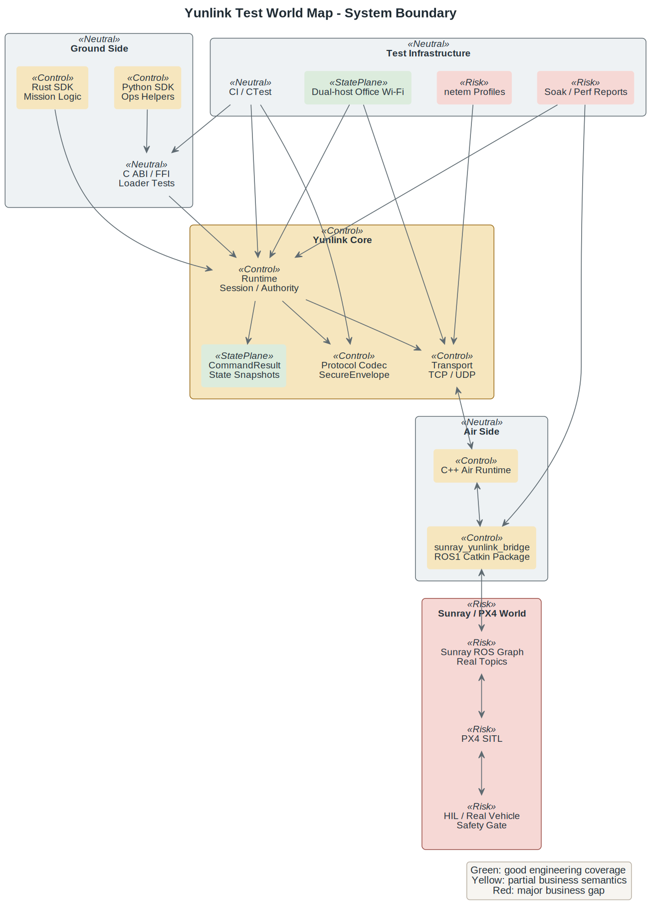
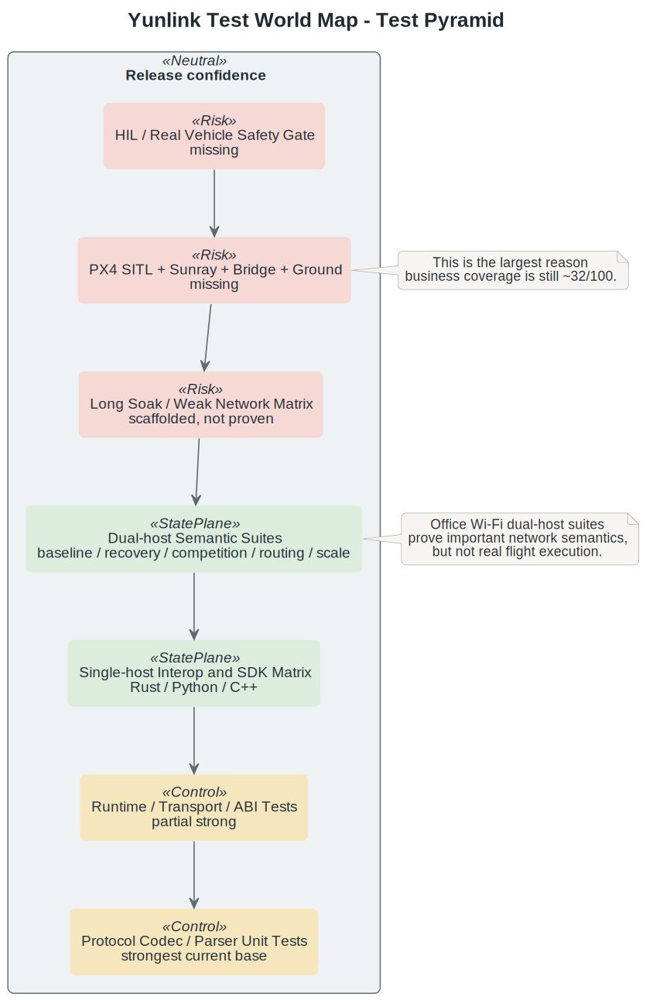
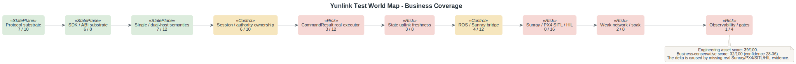
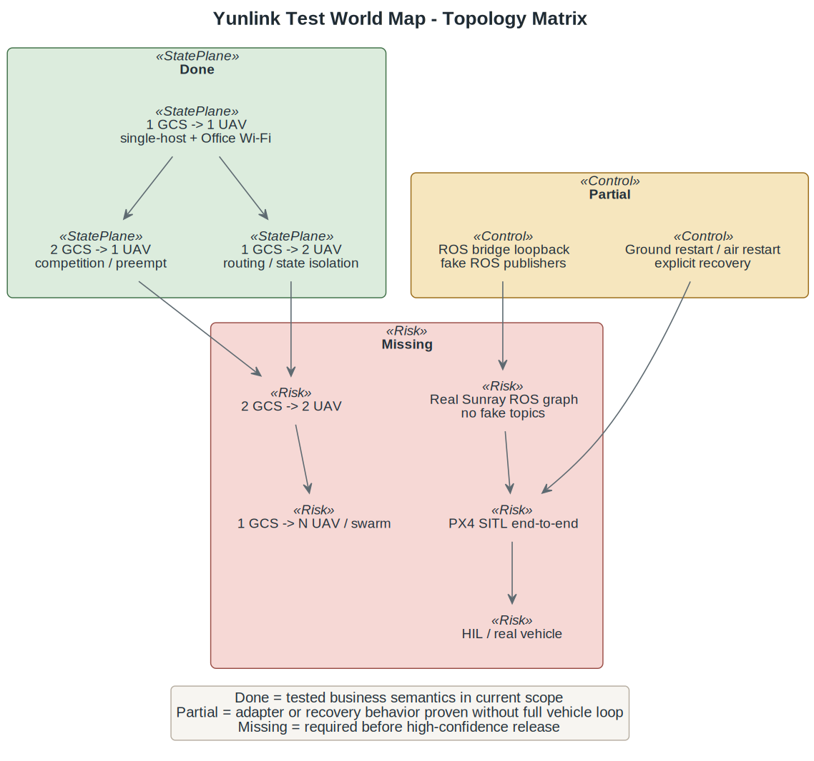
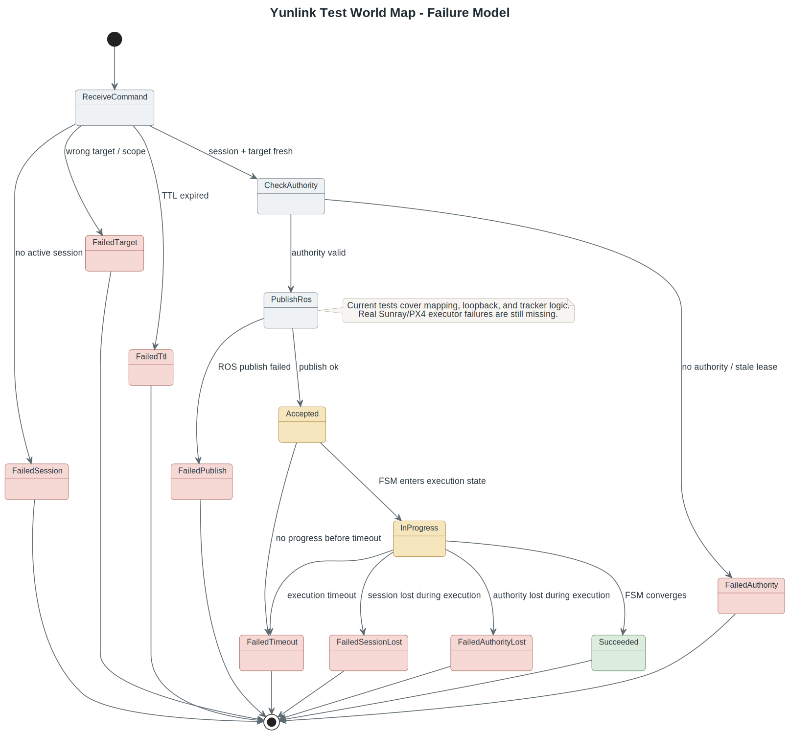
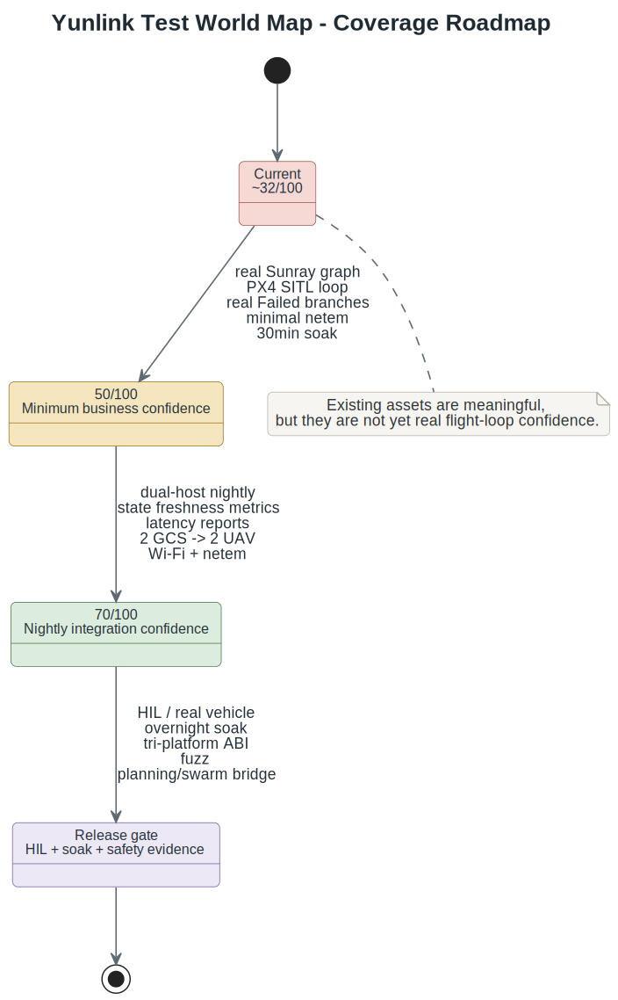

# Yunlink 测试世界地图

本文档是 `yunlink` 的业务测试覆盖主入口。它不替代细粒度矩阵与执行清单：

- [test-matrix.md](test-matrix.md)
- [testing-todo-checklist.md](testing-todo-checklist.md)
- [dual-host-lab-guide.md](dual-host-lab-guide.md)
- [ros1-docker-ubuntu26-guide.md](ros1-docker-ubuntu26-guide.md)

当前结论：工程测试资产已经较多，而且仓内闭环较此前更完整；截至 2026 年 4 月 28 日，Office Wi-Fi 双机 `baseline / recovery / competition / routing / scale` 已有最新实测、统一日志和固定 metrics 证据链。但从真实业务闭环看仍约 `32/100`，置信区间 `28-36`，未达到 `50%`。协议、SDK、单机/双机语义已有基础，ROS bridge 已有单元测试与 loopback；但真实 Sunray ROS graph、PX4 SITL、HIL/真机安全门控、弱网矩阵、长稳 soak 和真实飞控执行闭环仍缺。



## 为什么不是按测试数量算覆盖率

`yunlink` 的风险不是平均分布的。一个 parser roundtrip 测试和一次 `PX4 SITL + Sunray + bridge + Rust ground` 闭环测试，对业务可信度的贡献完全不同。因此本文档不按 case 数量、代码行覆盖率或目录数量计算，而按“业务能力域加权覆盖率”估算。

判断原则：

- 已有自动化测试但没有真实业务环境，只能算工程资产覆盖。
- 只有脚手架或 dry-run，不能算业务覆盖。
- fake publisher/subscriber 可以证明 adapter 逻辑，但不能证明 Sunray/PX4 执行闭环。
- Office Wi-Fi 双机实测可以证明网络语义，但不能代替弱网、soak 或 HIL。
- `32/100` 是业务可交付覆盖，不是代码覆盖率，也不是 case 数量覆盖率。

如果只按当前工程资产计分，可以写到约 `44/100`；保守业务口径折损为 `32/100`，因为真实 Sunray/PX4/SITL/HIL 域尚未进入验收。



## 业务能力域覆盖评分

| 业务域 | 权重 | 当前建议分 | 状态 | 解释 |
| --- | ---: | ---: | --- | --- |
| Protocol substrate | 10 | 8 | `partial-strong` | 线包、checksum、TTL codec、parser resilience、protocol mismatch 与 corruption 检测已覆盖；持续 fuzz 仍只提供 opt-in harness。 |
| SDK / ABI substrate | 8 | 7 | `partial-strong` | C ABI、Rust、Python、editable/wheel smoke 和 loader 已覆盖主路径，struct layout / `struct_size`、Rust drop/lagged/recovery、Python poll-thread/queue parity 也已有回归；长期资源压力与外部安装矩阵仍需补齐。 |
| Single-host / dual-host protocol semantics | 12 | 8 | `partial-strong` | 单机互操作与 Office Wi-Fi 双机 baseline/recovery/competition/routing/scale 已实测，并为当前 suite 统一产出 per-case 日志与六类固定 metrics。 |
| Runtime session / authority ownership | 10 | 7 | `partial-strong` | authority 主路径、session active/invalid/lost、断链收敛和目标域分片已有仓内证据；closed/draining 仍不是公开可单独驱动的仓内入口。 |
| Command result under real executor | 12 | 3 | `weak` | runtime/bridge 有结果流测试，但真实 Sunray 执行器下的失败分支尚未闭环。 |
| State uplink freshness and semantics | 8 | 3 | `weak` | snapshot 类型与 ROS mapping 已测，但真实频率、freshness、丢包退化和业务一致性未实测。 |
| ROS/Sunray bridge integration | 12 | 4 | `partial` | catkin build、24 个 gtest、mapping/tracker/loopback、launch smoke 已有；真实 Sunray graph 未接入。 |
| Real Sunray/PX4 SITL/HIL loop | 16 | 0 | `missing` | 尚无 PX4 SITL、Sunray controller/FSM、bridge、Yunlink ground 的端到端验收。 |
| Weak network / recovery / soak | 8 | 2 | `scaffolded` | netem profile、report/perf 脚手架与外部 suite 规格存在，但真实 profile 矩阵和长稳未跑。 |
| Observability and release gates | 4 | 2 | `scaffolded` | 有 summary/report 产物、双机 per-case stdout/stderr 与 metrics、测试矩阵与文档一致性回归，尚未形成完整 release-external gate。 |

合计：工程资产口径约 `44/100`；业务保守口径仍约 `32/100`，置信区间 `28-36`。



## 测试世界地图 Checklist

### Protocol substrate

- [x] 协议线包 roundtrip。
- [x] checksum 检测。
- [x] TTL codec 判定。
- [x] parser partial frame / split frame / glued frames。
- [x] malformed frame / truncated frame / garbage prefix / garbage suffix。
- [x] protocol version mismatch 的 runtime 拒绝路径。
- [x] payload 边界值、空字符串、长字符串、固定容量字段截断规则。
- [x] codec fuzz 入口。
- [ ] 持续 fuzz。

### Runtime session / authority / command

- [x] runtime `start -> stop -> start`。
- [x] stopped runtime API error。
- [x] authority `claim -> renew -> release -> expire -> reacquire -> preempt`。
- [x] session 存在但 authority 不存在的边界。
- [x] external command handling mode 关闭 auto-result。
- [x] explicit `CommandResult` helper 保留 correlation 与回包路径。
- [x] session open / active / invalid / lost 的完整状态切换。
- [ ] command 在真实执行器下的 `Received -> Accepted -> InProgress -> Succeeded/Failed`。
- [ ] 执行中 session 失效、authority 失效、TTL 过期、执行超时的真实失败分支。

### Transport and network

- [x] TCP local loop。
- [x] UDP source isolation。
- [x] TCP resilience 基础测试。
- [x] listener 未启动。
- [x] shared secret mismatch。
- [x] protocol mismatch。
- [ ] TCP half-open、RST 的真实异常链路。
- [ ] delay、jitter、loss、reorder、duplication、短断网的真实 netem 矩阵。
- [ ] 弱网下 command plane 与 state plane 的不同退化行为。

### ABI and language bindings

- [x] C ABI v1。
- [x] C ABI contract。
- [x] C shared library loader。
- [x] Rust runtime tests。
- [x] Python runtime tests。
- [x] Python wheel smoke。
- [x] `tools/bindings/run_all.sh` bindings matrix。
- [x] tri-platform 结构体 layout、字段大小、对齐和 `struct_size` 契约。
- [x] Rust/Python 资源释放、队列背压、恢复 helper 的 repo-local 回归。
- [ ] Rust/Python 长期资源压力稳定性。

### Single-host and dual-host semantics

- [x] 单机互操作：Rust/Python/C++ ground-air 组合。
- [x] stop/restart 后显式 recovery helper。
- [x] 双机 Office Wi-Fi baseline。
- [x] 双机 Office Wi-Fi recovery。
- [x] 双机 Office Wi-Fi competition。
- [x] 双机 Office Wi-Fi routing。
- [x] 双机 Office Wi-Fi `Rust air ↔ Rust ground` baseline。
- [x] 双机 authority 自然过期后的显式恢复。
- [x] 双机 peer 断链后的显式 `reconnect -> reopen -> reacquire`。
- [x] `dual-host-competition` 连续 10 次通过。
- [x] `dual-host-routing` 连续 10 次通过。
- [x] `2 GCS -> 2 UAV`。
- [ ] 双机有线 LAN 基线。
- [ ] host 间时钟不同步、网卡切换、短时断网。
- [ ] `1 GCS -> N UAV` 容量入口。



### ROS/Sunray bridge

- [x] ROS1 Docker Noetic 部署。
- [x] catkin build。
- [x] 24 个 gtest。
- [x] `Takeoff/Land/Return/Goto/VelocitySetpoint` 到 `UAVControlCMD` 的 mapping。
- [x] `Px4State/OdomStatus/UAVControlFSMState/UAVControllerState` 到 Yunlink snapshots 的 mapping。
- [x] command tracker 成功和失败基础推导。
- [x] Yunlink loopback。
- [x] launch smoke。
- [ ] 真实 Sunray ROS graph 集成测试，不只是 fake ROS publisher/subscriber。
- [ ] PX4 SITL + Sunray + bridge + Yunlink ground 的端到端闭环。
- [ ] HIL / 真机安全门控。
- [ ] planning bridge、`TrajectoryChunkCommand`、`FormationTaskCommand`、swarm/group target 的业务闭环。

### Weak network, soak, observability

- [x] netem profile 脚手架。
- [x] report renderer 脚手架。
- [x] perf aggregator 脚手架。
- [x] Office Wi-Fi 当前 suite 的固定 metrics 与 per-role stdout/stderr 证据链。
- [ ] netem profile 真实执行矩阵。
- [ ] 30min soak。
- [ ] 2h soak。
- [ ] overnight soak。
- [ ] CPU、memory、thread、fd/socket、P95/P99 latency 采集。
- [ ] PR / nightly / release 分级门禁。



## 已完成测试与脚本索引

### C++ core and runtime

- `test_protocol`
- `test_parser`
- `test_parser_resilience`
- `test_protocol_corruption`
- `test_compat_roundtrip`
- `test_transport_loop`
- `test_udp_source_isolation`
- `test_runtime_control_paths`
- `test_uav_state_snapshots`
- `test_authority_edges`
- `test_runtime_restart`
- `test_remote_reconnect`
- `test_external_command_handling`
- `test_runtime_stopped_errors`
- `test_session_security`
- `test_state_plane_semantics`
- `test_command_result_edges`
- `test_routing_and_source_validation`
- `test_tcp_resilience`

### ABI and bindings

- `test_c_ffi_v1`
- `test_c_ffi_contract`
- `test_c_ffi_loader`
- `cargo test -p yunlink --manifest-path bindings/rust/Cargo.toml`
- `python -m unittest discover -s bindings/python/tests`
- `tools/bindings/run_all.sh`
- `tools/bindings/build_python_wheel.sh`

### Tooling, dual-host, and reports

- `test_ci_regressions`
- `test_testing_tooling`
- `tools/testing/dual_host/run_suite.py`
- `tools/testing/dual_host/office_wifi_lab.yaml`
- `tools/bindings/python_ground_authority_expiry_recovery.py`
- `tools/bindings/python_ground_2gcs_2uav.py`
- `example_cxx_ground_peer_recovery`
- `tools/testing/netem/apply_profile.sh`
- `tools/testing/netem/clear_profile.sh`
- `tools/testing/report/render_summary.py`
- `tools/testing/perf/run_perf_suite.py`

### ROS bridge

- 外部 bridge 仓库中的 command/state mapping、tracker 与 loopback 测试
- `roslaunch sunray_yunlink_bridge sunray_yunlink_bridge.launch --nodes`

## 关键缺口与下一阶段优先级

P0：把 `32/100` 推到 `50/100`。

- 接入真实 Sunray ROS graph，验证 bridge 默认 topic contract。
- 建立 PX4 SITL + Sunray + bridge + Rust ground 的端到端闭环。
- 补齐真实执行器下 `CommandResult.Failed` 分支。
- 跑一轮最小 netem 矩阵：delay、loss、短断网。
- 建立 30min soak，采集 CPU、memory、thread、fd/socket 和 latency。

P1：把 `50/100` 推到 `70/100`。

- 增加有线 LAN、Wi-Fi + netem、air restart、ground restart 的组合矩阵。
- 把 `connect/session/authority/command/state/recovery` 六类固定 metrics 持续汇总进报告与 nightly 产物。
- 把双机 baseline/recovery/competition/routing 变成 nightly gate。
- 增加 `2 GCS -> 2 UAV` 与 `1 GCS -> N UAV` 容量入口。

P2：进入 release gate。

- HIL / 真机安全门控。
- overnight soak。
- fuzz、ABI layout、tri-platform install smoke。
- planning bridge、TrajectoryChunk、FormationTask、swarm/group target 的真实业务闭环。



## 验收命令

Core and CI-style local regression:

```bash
cmake --preset ci-ninja
python3 tools/build_fast.py --preset ci-ninja
ctest --test-dir build/ci-ninja --output-on-failure
```

Bindings matrix:

```bash
tools/bindings/run_all.sh
```

ROS bridge tests, inside the ROS1 Docker/catkin workspace:

```bash
source /opt/ros/noetic/setup.bash
source /root/ros1_ws/bridge_ws/devel/setup.bash
cd /root/ros1_ws/bridge_ws
catkin_make run_tests
catkin_test_results
```

ROS bridge launch smoke:

```bash
source /opt/ros/noetic/setup.bash
source /root/ros1_ws/bridge_ws/devel/setup.bash
roslaunch sunray_yunlink_bridge sunray_yunlink_bridge.launch --nodes
```

Diagram rendering:

```bash
tools/render_protocol_diagrams.sh
```
