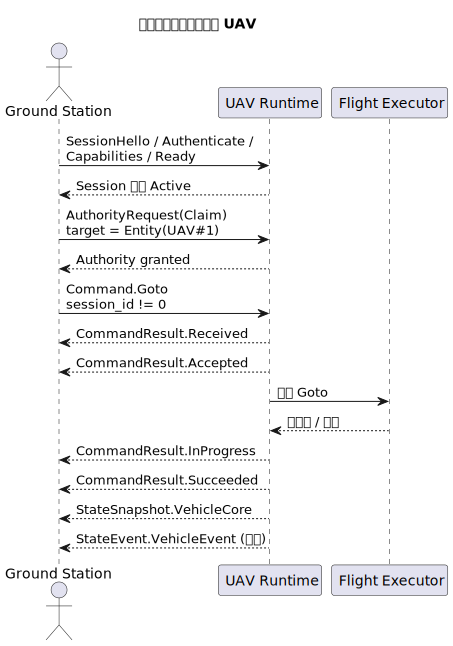
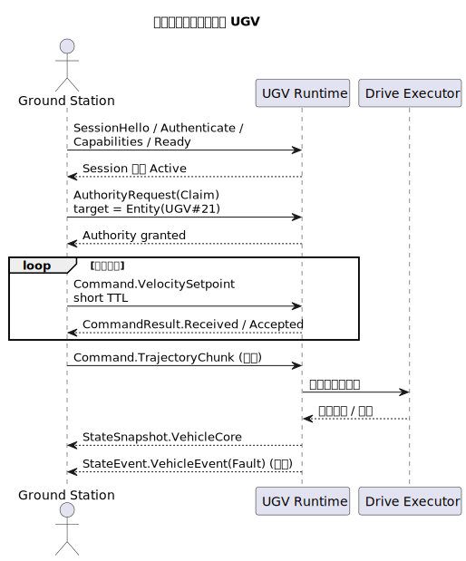
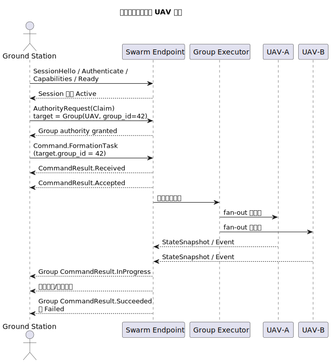

# Yunlink 协议场景 Walkthrough

本文档提供三个协议落地场景的 walkthrough，并明确区分“协议上应该发生什么”和“当前 repo 已经能直接对照到什么”。字段与状态定义仍以 [yunlink-protocol-spec.md](yunlink-protocol-spec.md) 为准；仓库现实边界以 [implementation-status.md](implementation-status.md) 为准。

## 1. 场景 A：地面站控制单架 UAV

读图目的：先把单 UAV 的成功路径压缩成一张协议协作时序图，再对照下面的实现覆盖、关键字段和失败分支去读。

### 场景目标

地面站与单架 UAV 建立会话，申请控制权，下发 `GotoCommand`，接收命令结果，并持续订阅 `VehicleCoreState` 与 `VehicleEvent`。

### 当前 repo 可对照的实现

- `tests/test_compat_roundtrip.cpp`
- `tests/test_runtime_control_paths.cpp`
- `examples/tcp_command_client/main.cpp`
- `examples/telemetry_receiver/main.cpp`

### 参与方

- 地面站 `Ground Station`
- UAV 机载协议端点 `Onboard Computer`
- 机载执行器 `Vehicle Executor`

### 成功路径

1. 建立可靠链路并选择 peer route
2. 地面站按顺序单向发送 `SessionHello`、`SessionAuthenticate`、`SessionCapabilities`、`SessionReady`
3. 会话进入 `Active`
4. 地面站发出 `AuthorityRequest(action=Claim)`
5. UAV 端本地更新控制权租约
6. 地面站发送 `GotoCommand`
7. UAV 端当前默认 runtime 回传 `Received`、`Accepted`、`InProgress`、`Succeeded`
8. UAV 端持续上报 `VehicleCoreState`，必要时上报 `VehicleEvent`

### 关键字段

| 关注项 | 说明 |
| --- | --- |
| `session_id` | 会话必须非零且在命令与结果中保持一致 |
| `correlation_id` | 命令根消息等于自身 `message_id`；结果指向命令 `message_id` |
| `target` | 应为 `TargetSelector::for_entity(kUav, <id>)` |
| `ttl_ms` | 运动命令应显式设置 |

### 失败分支

- 共享密钥不匹配：会话不进入 `Active`
- 未申请到控制权：`GotoCommand` 不应被执行；当前 runtime 会返回稳定 `CommandResult.Failed(detail=no-authority)`
- 目标 UAV ID 不匹配：当前 runtime 会返回稳定 `CommandResult.Failed(detail=wrong-target)`
- 命令过期：当前 runtime 会返回稳定 `CommandResult.Expired(detail=runtime-ttl-expired)`

### SDK 映射

- `SessionClient::open_active_session()`
- `Runtime::request_authority()`
- `CommandPublisher::publish_goto()`
- `EventSubscriber::subscribe_command_results()`
- `StateSubscriber::subscribe_vehicle_core()`

### 最小闭环检查表

- 是否拿到非零 `session_id`
- `SessionServer::has_active_session()` 是否为真
- 是否看到命令结果流且 `correlation_id` 指向原命令
- 是否收到 `VehicleCoreState`

## 2. 场景 B：地面站控制单台 UGV

读图目的：先看清 UGV 控制的时序骨架，再带着“连续控制 + 短 TTL”的约束去读下面的成功路径与失败分支。

### 场景目标

地面站对单台 UGV 建立控制链路，申请控制权，下发 `VelocitySetpointCommand` 或轨迹分块命令，并持续观察车辆状态与故障事件。

### 当前 repo 可对照的实现

- `VelocitySetpointCommand`、`TrajectoryChunkCommand` 的类型、traits 与 payload codec 已存在
- 当前没有专门的 UGV 执行器样例，也没有单独的 UGV runtime 测试闭环

### 成功路径

1. 建立会话并进入 `Active`
2. 地面站申请 UGV 单体控制权
3. 地面站周期发送 `VelocitySetpointCommand`，必要时发送 `TrajectoryChunkCommand`
4. UGV 端回传命令结果流
5. UGV 端周期发送 `VehicleCoreState`，故障时发送 `VehicleEvent(kind=Fault)`

### 关键字段

| 关注项 | 说明 |
| --- | --- |
| `target` | 应为 UGV 单体目标 |
| `body_frame` | 标明速度指令坐标系 |
| `ttl_ms` | 连续控制命令必须短 TTL |
| `VehicleEvent.severity` | 故障等级 |

### 失败分支

- 控制权被其他端持有且不允许抢占
- 连续控制链路抖动导致命令超时
- 车辆状态仍在上报，但控制命令不再被接受，应优先排查控制权或会话状态

### 当前 repo 需要额外注意

- 这是协议参考场景，不是当前仓库已经完整跑通的专用 UGV runtime。
- 如果你要按当前 repo 落地 UGV 控制，需要自己补执行器映射、失败路径和更细粒度 UGV 状态面。

### SDK 映射

- `CommandPublisher::publish_velocity_setpoint()`
- `CommandPublisher::publish_trajectory_chunk()`
- `EventSubscriber::subscribe_vehicle_event()`

### 最小闭环检查表

- 是否持有该 UGV 的控制权租约
- `VelocitySetpointCommand` 是否具备短 TTL
- 是否收到 `Fault` 或其它关键事件
- 快照与事件是否未相互污染

## 3. 场景 C：地面站控制 UAV 集群

读图目的：先看清群组级命令结果与成员级状态回流是两条不同语义线，再去对照当前 repo 的实现边界。

### 场景目标

地面站对一个 UAV 群组目标发送 `FormationTaskCommand`，并获取群组级回执以及成员级状态/事件回流。

### 当前 repo 可对照的实现

- `TargetScope::kGroup`、`FormationTaskCommand`、`target.group_id` 的线包与 payload 表达已存在
- 当前没有 swarm coordinator / group executor 样例
- 当前 `TargetSelector::matches()` 已按 endpoint `group_ids` 精确匹配 `group_id`，但 repo 内仍没有真实 swarm coordinator / group executor 样例

### 参与方

- 地面站
- 集群会话或协调端点
- 群组执行器
- 至少两个成员 UAV

### 成功路径

1. 地面站与集群端点建立 `Session`
2. 地面站对 `TargetScope::kGroup` 目标申请控制权
3. 地面站发送 `FormationTaskCommand`，`target.group_id` 与 payload `group_id` 一致
4. 集群端点返回群组级 `CommandResult`
5. 各成员 UAV 回传各自状态快照和关键事件

### 关键字段

| 关注项 | 说明 |
| --- | --- |
| `target.scope` | 必须为 `kGroup` |
| `target.group_id` | 群组目标标识 |
| `FormationTaskCommand.group_id` | 应与 envelope 一致 |
| `CommandResult.correlation_id` | 统一指向群组任务根消息 |

### 失败分支

- 群组不存在或成员为空
- 只有部分成员在线，群组任务只能部分接受
- 个别成员执行失败，群组级终态应能体现失败或部分成功策略

### 当前 repo 需要额外注意

- 这是协议参考场景，不应被误读为“仓库已经具备真实群组执行语义”。
- 当前如果直接把 `kGroup` 命令喂给 runtime，线包目标匹配与 formation payload 一致性会被校验，但真实成员调度、群组聚合器与部分成功策略仍属于业务层。

### SDK 映射

- `CommandPublisher::publish_formation_task()`
- `EventSubscriber::subscribe_command_results()`
- `StateSubscriber::subscribe_vehicle_core()`

### 最小闭环检查表

- 是否真正使用 `kGroup` 目标，而不是应用层拆多条单播
- `group_id` 是否在 envelope 与 payload 中一致
- 是否既看到群组级结果，又看到成员级状态回流

## 4. 当前 repo 的落地提示

- 单 UAV 最小闭环已经有较完整的测试和示例覆盖
- 单 UGV 与 Swarm 目前更偏协议语义、消息建模和字段一致性表达
- 真实执行器、群组聚合器与 bulk sidecar/data plane 的现实边界，请参考 [implementation-status.md](implementation-status.md)
