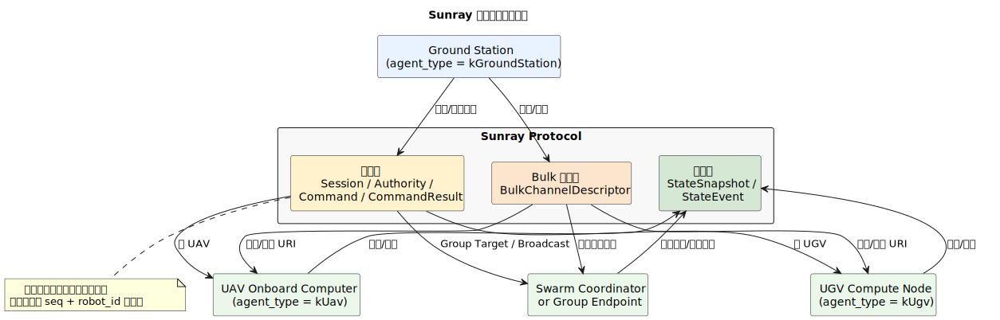
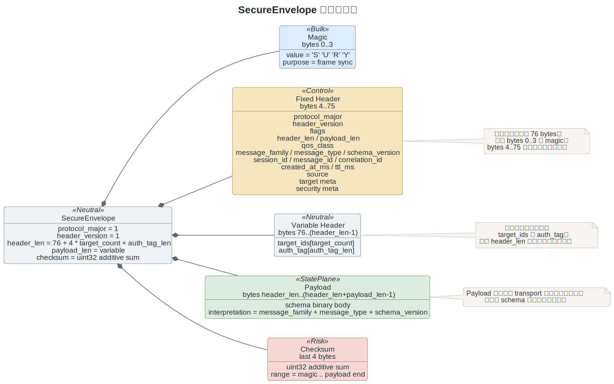
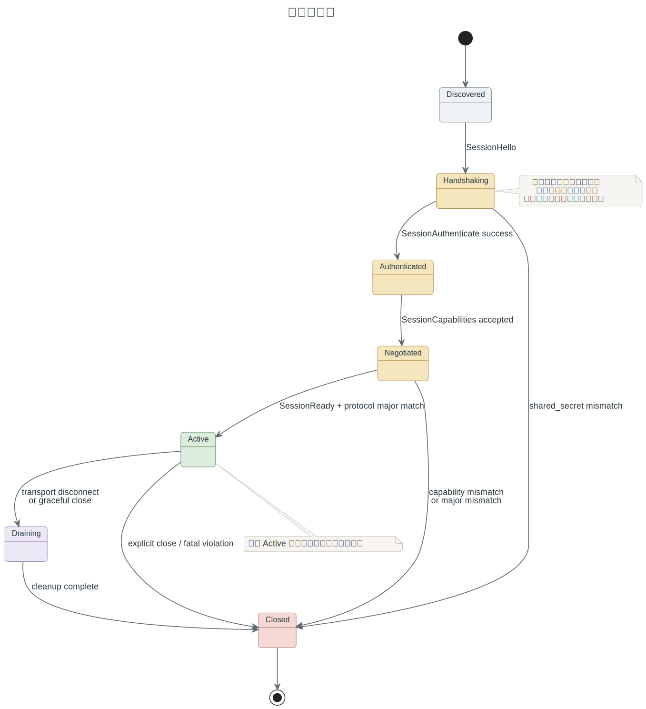
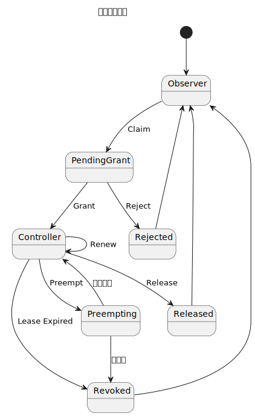
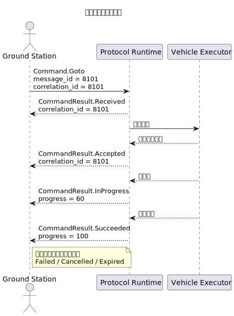
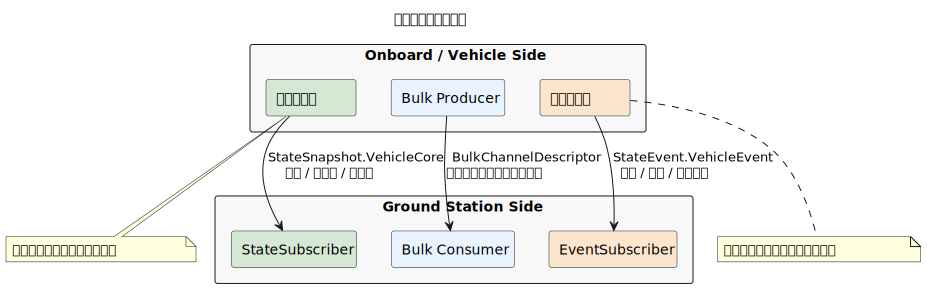

# Yunlink 新一代统一协议规范

## 1. 文档目的与适用范围

本文档定义 Yunlink 新一代统一协议（下文简称“Yunlink Protocol”）的线包结构、语义消息、会话、控制权、命令、状态面与大数据旁路发现机制。本文档是协议规范主文档，适用于以下对象：

- 地面站程序
- 无人机机载计算机
- 无人车计算单元
- 面向集群任务的协调控制节点

本规范覆盖的典型业务场景包括：

- 地面站对单架 UAV 的规划与控制
- 地面站对单台 UGV 的规划与控制
- 地面站对 UAV 集群的组播式控制
- 机载侧向地面站回传状态快照、离散事件和大流描述

本规范不覆盖以下内容：

- 历史兼容桥接或双栈叙事
- 飞控内部总线或车载内部 IPC
- 视频、点云、地图瓦片等大流内容本体的编码格式
- 编队算法、路径规划算法、任务分配算法本体
- 跨 major 版本的长期兼容承诺

阅读建议如下：

- 首次接入建议依次阅读第 3、5、6、9、10、11、12、13、16 章，再联读 `integration-guide.md`。
- 只查字段和编号时，可直接查阅第 6 章和第 19 章附录。
- 只关心当前 repo 已经实现到哪里时，请直接阅读 `implementation-status.md`。

## 2. 术语与约定

### 2.1 规范性用语

本文档中的关键字含义如下：

- “必须”表示强制要求。
- “应”表示默认要求，除非存在明确、受控、可解释的例外。
- “可以”表示允许但不强制。
- “不应”表示默认禁止，除非存在明确理由。

### 2.2 术语

| 术语 | 含义 |
| --- | --- |
| `SecureEnvelope` | 协议稳定线包，负责承载通用头、寻址、QoS、时序和安全上下文。 |
| `Payload Schema` | 由 `message_family + message_type + schema_version` 唯一标识的业务体结构。 |
| `Session` | 控制链路上的逻辑会话，负责握手、认证、协商和活跃期管理。 |
| `Authority` | 控制权租约，定义谁在给定目标域上拥有控制资格。 |
| `Snapshot` | 周期性状态快照，描述某一时刻的完整或近完整状态。 |
| `Event` | 离散状态事件，描述稀疏、关键、需被注意的状态变化。 |
| `Bulk Channel` | 大数据旁路通道，用于视频、点云等高吞吐内容。 |
| `Target Scope` | 目标域，包含实体单播、组播、广播三类。 |
| `correlation_id` | 关联 ID，用于把一个事务下的多条消息串起来。 |
| `TTL` | 消息时效，单位毫秒，超时后接收端不应执行。 |

### 2.3 数据表示约定

- 除非另有说明，整数均按小端字节序编码。
- `created_at_ms`、`ttl_ms`、`lease_ttl_ms`、`dt_ms` 等时间字段单位均为毫秒。
- 浮点字段在当前实现中按 IEEE 754 `float32` 小端编码。
- `session_id`、`message_id`、`correlation_id` 为 64 位无符号整数。
- `agent_id`、`group_id` 为 32 位无符号整数。
- `schema_version` 为 16 位无符号整数。

### 2.4 ID 规则

- `session_id` 必须在发起方的活跃会话范围内唯一。
- `message_id` 必须在同一 `source` 端点的活跃发送窗口内唯一，建议在 `source + session_id` 范围内唯一。
- `correlation_id` 应指向当前事务根消息的 `message_id`。
- 对于根事务消息，`correlation_id` 可以等于自身的 `message_id`。
- `session_id = 0` 仅适用于无会话状态消息，例如部分 `StateSnapshot`、`StateEvent`、`BulkChannelDescriptor`。
- 控制类消息不应使用 `session_id = 0`。

## 3. 系统角色与总体架构

### 3.1 角色

| 角色 | 说明 |
| --- | --- |
| `Ground Station` | 任务发起方、观察方或控制方。 |
| `Onboard Computer` | 机载/车载协议端点，负责接收控制、发布状态、协商 Bulk 通道。 |
| `Vehicle` | 受控实体，可是 UAV 或 UGV。 |
| `Observer` | 只看不控的会话参与者。 |
| `Controller` | 当前持有控制权租约的控制者。 |
| `Relay` | 中继或桥接节点，不拥有业务控制含义。 |
| `Swarm Controller` | 面向集群执行群组任务的控制端或协调端。 |

### 3.2 总体架构

Yunlink Protocol 逻辑上分成三条面：

- 控制面：承载 `Session`、`Authority`、`Command`、`CommandResult`。
- 状态面：承载 `StateSnapshot` 和 `StateEvent`。
- 大流面：由 `BulkChannelDescriptor` 在主协议内发现和授权，实际内容走旁路通道。

读图目的：先建立“参与方通过哪几条协议面发生关系”的整体心智，再进入 wire layer、状态机和场景细节。



### 3.3 基本原则

- 所有业务消息都必须包裹在 `SecureEnvelope` 内。
- 接收端必须根据 `(message_family, message_type, schema_version)` 解释业务体。
- 协议语义不能由 transport 类型或私有消息编号反推。
- 同一协议必须同时覆盖单机 UAV、单机 UGV、群组目标和广播目标。

## 4. 设计目标与非目标

### 4.1 设计目标

- 用稳定 `Envelope` 取代旧 `FrameHeader/Frame` 主模型。
- 用 `source` 和 `target` 统一表达身份与目标域。
- 用 `message_family + message_type + schema_version` 统一表达消息语义。
- 在协议层内建会话、认证、能力协商和控制权。
- 对控制消息提供可关联、可过期、可追踪的结果流。
- 对上行状态使用“周期快照 + 关键事件”双面模型。
- 用统一目标域表达单机、车辆、组播和广播。
- 让 SDK 以语义 API 暴露，而不是以裸线包为主 API。

### 4.2 非目标

- 不把 ROS topic/消息模型直接等同于协议模型。
- 不在主控制链路中直接承载视频、点云等大流内容。
- 不把编队算法、规划算法写进协议。
- 不保留旧协议双栈兼容。

## 5. 协议分层模型

### 5.1 分层

| 层 | 职责 |
| --- | --- |
| Transport | 提供 TCP/UDP 等底层承载，不定义业务语义。 |
| `SecureEnvelope` Wire Layer | 统一头部、QoS、会话、寻址、安全上下文和校验。 |
| Semantic Message Layer | 通过消息族和业务类型表达会话、控制权、命令、状态和 Bulk 描述。 |
| SDK Layer | `Runtime` 及其 `SessionClient`、`SessionServer`、`CommandPublisher`、`StateSubscriber`、`EventSubscriber` 等语义接口。 |

### 5.2 SDK 语义接口映射

| SDK 接口 | 对应协议面 |
| --- | --- |
| `SessionClient` / `SessionServer` | `Session` |
| `Runtime::request_authority()` / `Runtime::release_authority()` / `Runtime::current_authority()` | `Authority` |
| `CommandPublisher` | `Command` |
| `EventSubscriber` for `CommandResult` | `CommandResult` |
| `StateSubscriber` | `StateSnapshot` |
| `EventSubscriber` for `VehicleEvent` | `StateEvent` |

### 5.3 关键边界

- 传输层只负责“送达”，不负责解释命令语义。
- `ProtocolCodec` 只负责 `SecureEnvelope` 编解码。
- Payload 解释只由 schema 标识驱动，不允许靠“某条 TCP 链路专门发某类消息”这种隐含约定完成。
- Bulk 发现与 Bulk 内容必须分离。

## 6. `Envelope` 线包规范

### 6.1 总体说明

`SecureEnvelope` 是协议的稳定线包。任何业务消息都必须由它承载。v1 固定头长度为 `76` 字节，尾部校验长度为 `4` 字节。

读图目的：把 `SecureEnvelope` 当成一个稳定对象来理解，先看组成块与解释边界，再读后面的字段表。



### 6.2 固定头字段与偏移

| 偏移 | 字段 | 大小 | 说明 |
| --- | --- | --- | --- |
| 0..3 | `magic` | 4 | 固定为 ASCII `SURY`。 |
| 4 | `protocol_major` | 1 | 协议 major 版本，当前为 `1`。 |
| 5 | `header_version` | 1 | 头部版本，当前为 `1`。 |
| 6..7 | `flags` | 2 | 头部标志位，v1 保留。 |
| 8..9 | `header_len` | 2 | 头部总长，含固定头和变长头。 |
| 10..13 | `payload_len` | 4 | 业务体长度，不含校验。 |
| 14 | `qos_class` | 1 | QoS 类别。 |
| 15 | `message_family` | 1 | 消息族编号。 |
| 16..17 | `message_type` | 2 | 消息类型编号。 |
| 18..19 | `schema_version` | 2 | Payload schema 版本。 |
| 20..27 | `session_id` | 8 | 会话 ID。 |
| 28..35 | `message_id` | 8 | 消息 ID。 |
| 36..43 | `correlation_id` | 8 | 关联 ID。 |
| 44..51 | `created_at_ms` | 8 | 发送时刻。 |
| 52..55 | `ttl_ms` | 4 | 时效，`0` 表示不强制过期。 |
| 56 | `source.agent_type` | 1 | 发送方类型。 |
| 57..60 | `source.agent_id` | 4 | 发送方 ID。 |
| 61 | `source.role` | 1 | 发送方角色。 |
| 62 | `target.scope` | 1 | 目标域类型。 |
| 63 | `target.target_type` | 1 | 目标实体类型。 |
| 64..67 | `target.group_id` | 4 | 组 ID。 |
| 68..69 | `target_count` | 2 | `target_ids` 数量。 |
| 70..73 | `security.key_epoch` | 4 | 密钥世代。 |
| 74..75 | `auth_tag_len` | 2 | 认证标签长度。 |

### 6.3 变长头字段

固定头之后依次排列：

1. `target_ids[target_count]`，每项 4 字节
2. `auth_tag[auth_tag_len]`

因此：

```text
header_len = 76 + target_count * 4 + auth_tag_len
```

### 6.4 业务体与尾部

- 变长头之后是 payload。
- 尾部是 4 字节 `checksum`。
- v1 `checksum` 计算方式为对“从 `magic` 到 payload 末尾”为止的所有字节做 32 位无符号加和。

### 6.5 线包合法性要求

- 接收端必须首先校验 `magic`。
- 若 `header_len < 76`，接收端必须拒绝。
- 若 `header_len` 与 `target_count`、`auth_tag_len` 推导结果不一致，接收端必须拒绝。
- 若 `payload_len` 与实际数据长度不一致，接收端必须拒绝。
- 若 `checksum` 不一致，接收端必须拒绝。
- 若 `ttl_ms > 0` 且消息已超时，接收端不应继续执行业务语义。

### 6.6 字段约束

- 控制类消息必须填写 `session_id`。
- 控制类根消息应令 `correlation_id = message_id`。
- `created_at_ms` 必须由发送端填写为本地发送时刻。
- `flags` 在 v1 中保留，发送端应填 `0`，接收端应忽略未知位。
- `auth_tag` 可以为空，但在正式受保护会话中不应为空。

## 7. 身份、寻址与目标选择

### 7.1 `source`

`source` 由 `(agent_type, agent_id, role)` 组成。

#### `AgentType`

| 值 | 含义 |
| --- | --- |
| `0` | `kUnknown` |
| `1` | `kGroundStation` |
| `2` | `kUav` |
| `3` | `kUgv` |
| `4` | `kSwarmController` |

#### `EndpointRole`

| 值 | 含义 |
| --- | --- |
| `0` | `kUnknown` |
| `1` | `kObserver` |
| `2` | `kController` |
| `3` | `kVehicle` |
| `4` | `kRelay` |

### 7.2 `target`

`target` 由 `(scope, target_type, group_id, target_ids[])` 组成。

| `TargetScope` | 用途 | 约束 |
| --- | --- | --- |
| `kEntity` | 单播到一个或多个明确实体 | `target_ids` 必须非空；`group_id` 应为 `0`。 |
| `kGroup` | 面向逻辑组播 | `group_id` 必须非零；`target_ids` 应为空。 |
| `kBroadcast` | 面向某一类型或全类型广播 | `group_id` 必须为 `0`；`target_ids` 必须为空。 |

### 7.3 目标选择规则

- `target_type = kUnknown` 仅应用于广播型发现或全类广播。
- 控制消息面向 `kEntity` 或 `kGroup` 时，应精确表达目标，不应靠“多条单播拼接”伪装组播。
- `kBroadcast` 更适用于发现、公告、紧急告警和观察类流量；是否允许广播控制应由部署策略明确授权。
- `FormationTaskCommand` 等群组命令的 payload 内部组字段应与 `target.group_id` 保持一致。

### 7.4 匹配规则

接收端应按如下优先级判断是否匹配目标：

1. `scope = kBroadcast` 时按 `target_type` 粗匹配。
2. `scope = kGroup` 时按组成员关系匹配。
3. `scope = kEntity` 时按 `target_ids` 精确匹配。

当前 repo 的最小实现仍有边界：

- `kEntity` 已按 `target_ids` 精确匹配。
- `kGroup` 当前还没有真实组成员关系，runtime 只按 `target_type` 做粗匹配。
- 这些实现限制不改变本规范的应然要求，但接入当前仓库时必须联读 [implementation-status.md](implementation-status.md)。

## 8. QoS 与传输语义

### 8.1 `QosClass`

| 值 | 含义 | 典型用途 |
| --- | --- | --- |
| `1` `kReliableOrdered` | 可靠且有序 | 会话、控制权、关键命令、命令结果 |
| `2` `kReliableLatest` | 可靠，但消费者关注最新值 | 周期状态快照 |
| `3` `kBestEffort` | 尽力而为 | 高频事件、低价值提示流 |
| `4` `kBulk` | 大流语义或为大流路径预留 | 旁路 Bulk 内容或相关扩展 |

### 8.2 默认 QoS 绑定

| 消息族 | 默认 QoS |
| --- | --- |
| `Session` | `kReliableOrdered` |
| `Authority` | `kReliableOrdered` |
| `Command` | `kReliableOrdered` |
| `CommandResult` | `kReliableOrdered` |
| `StateSnapshot` | `kReliableLatest` |
| `StateEvent` | `kBestEffort` |
| `BulkChannelDescriptor` | `kReliableOrdered` |

### 8.3 传输层建议

- `kReliableOrdered` 应优先走 TCP 或等价可靠链路。
- `kReliableLatest` 可以走可靠链路，也可以由中间件以“覆盖最新值”方式优化。
- `kBestEffort` 适合 UDP 单播、广播或组播。
- `Bulk` 内容不应与主控制链路混跑。

### 8.4 重复、乱序与迟到

- 控制面消费者应使用 `message_id` 和 `correlation_id` 去重与串联。
- 对 `kReliableLatest`，接收端可以丢弃明显过旧的状态。
- 对 `kBestEffort`，接收端必须容忍丢包与乱序。
- 对已超 TTL 的控制消息，接收端不应再执行。

## 9. 会话协议

### 9.1 目的

`Session` 用于建立协议级上下文，使控制类消息拥有可认证、可协商、可追踪的会话边界。

### 9.2 消息类型

| `message_type` | 名称 | 作用 |
| --- | --- | --- |
| `1` | `SessionHello` | 宣告节点名与能力位图 |
| `2` | `SessionAuthenticate` | 发送认证信息 |
| `3` | `SessionCapabilities` | 发送能力协商位图 |
| `4` | `SessionReady` | 声明协议 major 已接受，可进入活跃态 |

### 9.3 状态机

读图目的：关注会话从发现、握手、认证、协商到 `Active` 的推进条件，以及失败或断链后如何收束。



状态如下：

- `Discovered`
- `Handshaking`
- `Authenticated`
- `Negotiated`
- `Active`
- `Draining`
- `Closed`

### 9.4 建议流程

1. 发起方分配 `session_id`。
2. 发起方发送 `SessionHello`。
3. 发起方发送 `SessionAuthenticate`。
4. 发起方发送 `SessionCapabilities`。
5. 发起方发送 `SessionReady`。
6. 接收方在本地完成状态推进并进入 `Active`。

会话消息应使用：

- `message_family = Session`
- `qos_class = kReliableOrdered`
- 同一握手事务共享同一个 `correlation_id`

当前 repo 的最小会话实现就是上述“发起方单向发送四条消息、接收方本地推进状态”的路径；更完整的双向协商、断链恢复和能力裁决仍属于待补齐实现。

### 9.5 字段要求

#### `SessionHello`

| 字段 | 说明 |
| --- | --- |
| `node_name` | 节点名称，便于日志与调试 |
| `capability_flags` | 能力位图 |

#### `SessionAuthenticate`

| 字段 | 说明 |
| --- | --- |
| `shared_secret` | 共享认证信息，正式环境建议替换为更强机制 |

#### `SessionCapabilities`

| 字段 | 说明 |
| --- | --- |
| `capability_flags` | 发起方实际声明的能力位图 |

#### `SessionReady`

| 字段 | 说明 |
| --- | --- |
| `accepted_protocol_major` | 本次会话接受的协议 major |

### 9.6 协议要求

- 未进入 `Active` 的会话不应承载控制类命令。
- `accepted_protocol_major` 与线包中的 `protocol_major` 不一致时，不应进入 `Active`。
- 认证失败时，会话必须进入 `Closed` 或等效拒绝态。
- 能力不匹配时，会话不应进入 `Active`。
- transport 断连时，已建立会话应进入 `Draining` 或 `Closed`，是否快速恢复由部署策略决定。

## 10. 控制权协议

### 10.1 目的

`Authority` 用于表达“谁在某个目标域上拥有控制资格”。默认拓扑为“单控多看”：同一目标域任意时刻只允许一个控制端，允许多个观察端。

### 10.2 消息类型

| `message_type` | 名称 | 作用 |
| --- | --- | --- |
| `1` | `AuthorityRequest` | 申请、续租、释放、抢占控制权 |
| `2` | `AuthorityStatus` | 告知控制权状态与原因 |

### 10.3 状态机

读图目的：区分控制权主路径与分支路径，尤其是 `Controller`、`Preempting`、`Revoked` 之间的关系。



状态如下：

- `Observer`
- `PendingGrant`
- `Controller`
- `Preempting`
- `Revoked`
- `Released`
- `Rejected`

### 10.4 `AuthorityRequest`

| 字段 | 说明 |
| --- | --- |
| `action` | `Claim / Renew / Release / Preempt` |
| `source` | 控制来源，如 `GroundStation`、`RemoteController` |
| `lease_ttl_ms` | 租约有效时长 |
| `allow_preempt` | 是否允许抢占 |

### 10.5 `AuthorityStatus`

| 字段 | 说明 |
| --- | --- |
| `state` | 当前控制权状态 |
| `session_id` | 所属会话 |
| `lease_ttl_ms` | 当前租约时长 |
| `reason_code` | 细化原因码 |
| `detail` | 人类可读说明 |

### 10.6 协议要求

- `Authority` 消息必须绑定活跃 `session_id`。
- 控制权应绑定到明确目标域，而不是无目标的全局“抢锁”。
- `Claim` 在目标域空闲时应授予 `Controller`。
- `Renew` 只能由当前持有者执行。
- `Release` 只能由当前持有者执行。
- `Preempt` 需要部署策略允许，且应产生显式状态变更反馈。
- 租约过期时，接收端必须回收控制权。
- 未持有控制权的会话不应被执行控制命令。

### 10.7 广播与组播的控制权

- `kGroup` 应表示组级控制权。
- `kBroadcast` 不应作为常规控制权租约目标；如需使用，必须由部署策略明示。
- 集群任务应优先使用 group target，而不是广播单体运动控制。

## 11. 命令协议

### 11.1 设计原则

控制命令分成两层：

- 高层任务命令：适合业务语义清晰的任务式控制
- 低层连续控制：适合高频 setpoint 或轨迹分块

### 11.2 控制类消息统一要求

- `message_family` 必须为 `Command`。
- 必须带非零 `session_id`。
- 根命令应令 `correlation_id = message_id`。
- 应填写 `ttl_ms`，尤其是连续控制和运动命令。
- 发送方 `source.role` 应为 `Controller` 或受授权的自治控制角色。

### 11.3 命令目录

| `message_type` | 名称 | 类别 | 默认 QoS | 说明 |
| --- | --- | --- | --- | --- |
| `1` | `TakeoffCommand` | 高层任务 | `ReliableOrdered` | 起飞 |
| `2` | `LandCommand` | 高层任务 | `ReliableOrdered` | 降落 |
| `3` | `ReturnCommand` | 高层任务 | `ReliableOrdered` | 返航/回站 |
| `4` | `GotoCommand` | 高层任务 | `ReliableOrdered` | 到指定点位 |
| `5` | `VelocitySetpointCommand` | 连续控制 | `ReliableOrdered` | 速度指令 |
| `6` | `TrajectoryChunkCommand` | 连续控制 | `ReliableOrdered` | 轨迹分块 |
| `7` | `FormationTaskCommand` | 群组任务 | `ReliableOrdered` | 编队/群组任务 |

### 11.4 典型字段

#### `TakeoffCommand`

- `relative_height_m`
- `max_velocity_mps`

#### `LandCommand`

- `max_velocity_mps`

#### `ReturnCommand`

- `loiter_before_return_s`

#### `GotoCommand`

- `x_m`
- `y_m`
- `z_m`
- `yaw_rad`

#### `VelocitySetpointCommand`

- `vx_mps`
- `vy_mps`
- `vz_mps`
- `yaw_rate_radps`
- `body_frame`

#### `TrajectoryChunkCommand`

- `chunk_index`
- `final_chunk`
- `points[]`

每个 `TrajectoryPoint` 包含：

- 位置 `x/y/z`
- 速度 `vx/vy/vz`
- 航向 `yaw_rad`
- 时间增量 `dt_ms`

#### `FormationTaskCommand`

- `group_id`
- `formation_shape`
- `spacing_m`
- `label`

### 11.5 目标域要求

- `Takeoff`、`Land`、`Return`、`Goto` 默认面向单体或组。
- `VelocitySetpoint` 默认面向单体；对组播使用时应谨慎。
- `TrajectoryChunk` 可以用于单体轨迹或群组轨迹下发。
- `FormationTaskCommand` 应与 `kGroup` 目标配套使用。

## 12. 命令结果与执行反馈

### 12.1 目的

`CommandResult` 用于让控制方知道命令是否被收到、是否被接受、执行到了哪一步，以及最终是成功、失败、取消还是过期。

### 12.2 结果相位

| 值 | 相位 | 说明 |
| --- | --- | --- |
| `1` | `Received` | 协议端已收到命令 |
| `2` | `Accepted` | 语义与权限检查通过，准备执行 |
| `3` | `InProgress` | 执行中 |
| `4` | `Succeeded` | 成功结束 |
| `5` | `Failed` | 失败结束 |
| `6` | `Cancelled` | 被取消 |
| `7` | `Expired` | 因 TTL 或调度窗口失效 |

### 12.3 三段式回执

控制类消息默认支持“三段式回执 + 终态”：

1. `Received`
2. `Accepted`
3. `InProgress`
4. 终态：`Succeeded / Failed / Cancelled / Expired`

对于极短命令，可以省略 `InProgress`，但不应省略终态。

读图目的：把 `Received -> Accepted -> InProgress -> Terminal` 看成标准结果流骨架，失败终态只是替换最后一段。



### 12.4 `CommandResult` 字段

| 字段 | 说明 |
| --- | --- |
| `command_kind` | 原命令类型 |
| `phase` | 当前执行相位 |
| `result_code` | 细化结果码 |
| `progress_percent` | 进度百分比，0..100 |
| `detail` | 人类可读说明 |

### 12.5 关联要求

- `CommandResult.message_family` 必须为 `CommandResult`。
- `CommandResult.correlation_id` 必须指向原命令的 `message_id`。
- 对同一命令的多条结果，`correlation_id` 必须保持一致。
- `command_kind` 应与原始命令类型一致。

## 13. 状态快照与状态事件

### 13.1 双面模型

上行状态必须分为两面：

- `StateSnapshot`：稳定、可覆盖、适合订阅的周期状态
- `StateEvent`：稀疏、关键、离散的状态变化

不得用事件流拼出完整状态，也不应把快照流当作告警总线。

读图目的：确认 `Snapshot`、`Event`、`Bulk Descriptor` 三类流的边界，避免把状态面和告警面混成一条流。



### 13.2 `StateSnapshot`

当前最小快照类型为 `VehicleCoreState`，字段包括：

- `armed`
- `nav_mode`
- `x_m` `y_m` `z_m`
- `vx_mps` `vy_mps` `vz_mps`
- `battery_percent`

建议：

- 快照周期由部署确定。
- 快照应能让观察端快速理解当前核心控制状态。
- 快照不应混入只出现一次的故障文本或临时事件语义。

对于 UAV 接入，协议允许在 `VehicleCoreState` 之外补充更具业务语义的快照类型，例如：

- `Px4StateSnapshot`
- `OdomStatusSnapshot`
- `UavControlFsmStateSnapshot`
- `UavControllerStateSnapshot`
- `GimbalParamsSnapshot`

### 13.3 `StateEvent`

当前最小事件类型为 `VehicleEvent`，字段包括：

- `kind`
- `severity`
- `detail`

`VehicleEventKind` 当前定义：

- `Info`
- `Takeoff`
- `Landing`
- `ReturnHome`
- `FormationUpdate`
- `Fault`

建议：

- 事件应尽量短小、稀疏、可直接呈现。
- 对连续变化状态应优先进入快照。

### 13.4 会话与关联

- 状态消息可以不绑定控制会话，因此 `session_id` 可以为 `0`。
- 快照与事件通常不要求 `correlation_id`。
- 若事件由某个控制事务直接触发，可以把 `correlation_id` 指向触发命令。

## 14. Bulk 通道描述

### 14.1 目的

`BulkChannelDescriptor` 用于在主协议控制面里发现和授权旁路大流通道，而不是直接把点云、视频等大数据塞进主控制链路。

### 14.2 字段

| 字段 | 说明 |
| --- | --- |
| `stream_type` | `PointCloud / MapTile / Video` |
| `uri` | 旁路通道地址或资源定位符 |
| `mtu_bytes` | 建议传输单元 |
| `reliable` | 是否要求可靠大流通道 |

### 14.3 协议要求

- `BulkChannelDescriptor` 应通过主协议可靠传递。
- 收到 descriptor 后，接收端可以自主建立旁路通道。
- Bulk 通道失败不应阻塞主控制链路。
- 主协议必须只负责发现、授权和状态感知，而不是大流内容搬运。

## 15. 错误模型与异常处理

### 15.1 线包层错误

| 错误 | 典型来源 | 接收端行为 |
| --- | --- | --- |
| `kInvalidHeader` | `magic` 不匹配 | 丢弃该帧并记录错误 |
| `kDecodeError` | 头部长度、载荷长度非法 | 丢弃该帧并记录错误 |
| `kChecksumMismatch` | 校验失败 | 丢弃该帧 |
| `kTimeout` | TTL 已过期 | 不执行语义处理 |
| `kProtocolMismatch` | 版本不兼容 | 终止会话推进或拒绝处理 |

### 15.2 会话层异常

- 认证失败：会话必须进入 `Closed` 或拒绝态。
- 能力不匹配：不应进入 `Active`。
- transport 断开：已持有控制权的会话应进入失效路径。

### 15.3 控制权层异常

- 越权申请：应返回 `Rejected` 或等价错误结果。
- 非持有者续租/释放：应拒绝。
- 租约过期：应自动回收。

### 15.4 命令层异常

- 无活跃会话：不应执行命令。
- 未持有控制权：不应执行命令。
- TTL 过期：应返回 `Expired` 或静默丢弃并记录。
- 目标不匹配：不应执行命令。
- 未知 `message_type`：接收端应忽略并记录。

## 16. 示例场景使用

本章仅保留协议级场景索引，用于说明各类场景必须观察到哪些协议事实。详细 walkthrough、失败分支、SDK 映射与最小闭环检查表请阅读 [scenario-walkthroughs.md](scenario-walkthroughs.md)。

### 16.1 场景 A：地面站控制单架 UAV

读图目的：把单 UAV 最小闭环压缩成一张协议协作时序图，先看到 `Session -> Authority -> Command -> Uplink` 四段骨架。


协议级观察点：

- 必须先完成 `Session` 并进入 `Active`
- 必须先获得单体 `Authority`
- `GotoCommand` 的 `target` 必须指向单 UAV 目标
- `CommandResult.correlation_id` 必须稳定指向根命令
- 必须并行存在 `VehicleCoreState` 与 `VehicleEvent` 两个上行面

### 16.2 场景 B：地面站控制单台 UGV

读图目的：重点看出 UGV 场景并不是普通离散命令流，而是“连续控制 + 短 TTL + 事件回流”的组合。


协议级观察点：

- `VelocitySetpointCommand` 必须带短 TTL
- `TrajectoryChunkCommand` 与连续控制命令不能混淆为状态流
- `VehicleEvent(kind=Fault)` 应作为离散事件而非快照字段

### 16.3 场景 C：地面站控制 UAV 集群

读图目的：同时看见群组级结果和成员级回流两层语义，而不是把 swarm 控制误读成多参与方普通时序。


协议级观察点：

- 群组任务必须使用 `TargetScope::kGroup`
- `target.group_id` 与 payload 内组标识必须一致
- 群组级结果与成员级状态回流必须可区分
- 不允许把群组控制退化为协议主模型之外的多条单播

## 17. 当前实现状态说明

本规范定义协议应有能力，不直接承担实现覆盖矩阵与限制报告。当前 repo 的实现覆盖、已知限制与接入含义，请阅读 [implementation-status.md](implementation-status.md)。

特别是以下条目，不能只从规范正文推断“仓库已经具备”：

- `AuthorityStatus` 主动回执
- `kGroup` 的真实成员级匹配与群组执行
- TTL 在 runtime 收包路径中的自动强制执行
- bulk 通道的运行时消费与管理

## 18. 接入与联读导航

接入步骤、联调观察点与最小闭环建议，请阅读 [integration-guide.md](integration-guide.md)。

详细场景 walkthrough，请阅读 [scenario-walkthroughs.md](scenario-walkthroughs.md)。

关于历史模型向当前统一协议模型的迁移说明，请阅读 [migration-notes.md](migration-notes.md)。

## 19. 附录

### 19.1 消息族编号表

| 编号 | 消息族 |
| --- | --- |
| `1` | `Session` |
| `2` | `Authority` |
| `3` | `Command` |
| `4` | `CommandResult` |
| `5` | `StateSnapshot` |
| `6` | `StateEvent` |
| `7` | `BulkChannelDescriptor` |

### 19.2 已定义消息类型表

#### `Session`

| 编号 | 名称 |
| --- | --- |
| `1` | `SessionHello` |
| `2` | `SessionAuthenticate` |
| `3` | `SessionCapabilities` |
| `4` | `SessionReady` |

#### `Authority`

| 编号 | 名称 |
| --- | --- |
| `1` | `AuthorityRequest` |
| `2` | `AuthorityStatus` |

#### `Command`

| 编号 | 名称 |
| --- | --- |
| `1` | `TakeoffCommand` |
| `2` | `LandCommand` |
| `3` | `ReturnCommand` |
| `4` | `GotoCommand` |
| `5` | `VelocitySetpointCommand` |
| `6` | `TrajectoryChunkCommand` |
| `7` | `FormationTaskCommand` |

#### `CommandResult`

| 编号 | 名称 |
| --- | --- |
| `1` | `CommandResult` |

#### `StateSnapshot`

| 编号 | 名称 |
| --- | --- |
| `1` | `VehicleCoreState` |
| `2` | `Px4StateSnapshot` |
| `3` | `OdomStatusSnapshot` |
| `4` | `UavControlFsmStateSnapshot` |
| `5` | `UavControllerStateSnapshot` |
| `6` | `GimbalParamsSnapshot` |

#### `StateEvent`

| 编号 | 名称 |
| --- | --- |
| `1` | `VehicleEvent` |

#### `BulkChannelDescriptor`

| 编号 | 名称 |
| --- | --- |
| `1` | `BulkChannelDescriptor` |

### 19.3 一键渲染指令

```bash
./tools/render_protocol_diagrams.sh
doxygen docs/Doxyfile
```

脚本与命令会把：

- `docs/diagrams/plantuml/src/*.puml`

渲染到：

- `docs/diagrams/plantuml/svg/*.svg`

并把 API Reference 生成到：

- `build/doxygen/html/`

### 19.4 图目录

- `protocol_context_overview`
- `secure_envelope_wire_format`
- `session_lifecycle`
- `authority_lifecycle`
- `command_result_flow`
- `state_and_event_planes`
- `scenario_single_uav_control`
- `scenario_single_ugv_control`
- `scenario_swarm_control`

### 19.5 最后的约束提醒

- 不允许退回到历史兼容模型或私有编号驱动模型。
- 不允许把 group control 退化为协议主模型之外的“应用层拆多条单播”。
- 不允许把大流内容塞进主控制链路并声称仍符合本规范。
